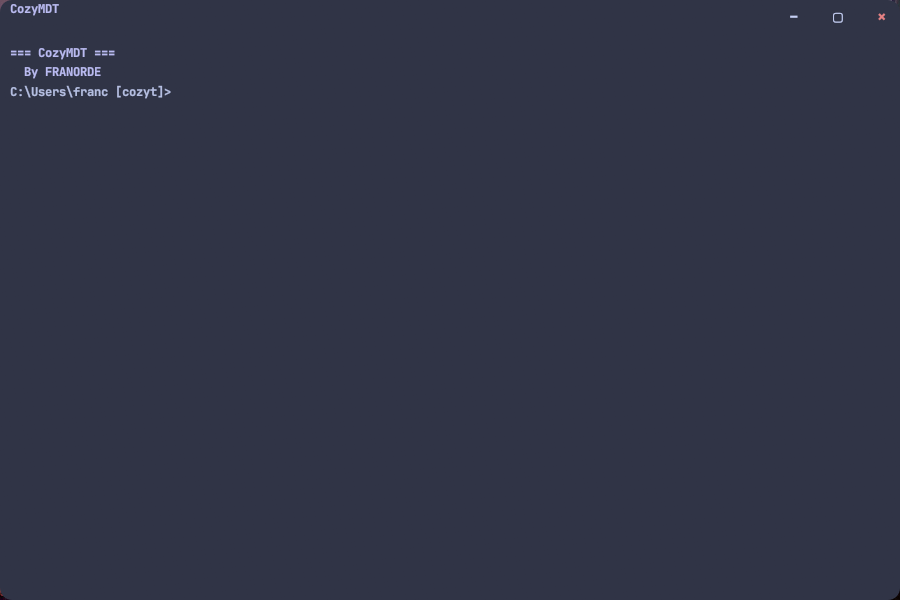

  

<h1 align="center">CozyMDT</h1>

The Coziest terminal.

  
  
  

# Installation

## Step 1

Download the latest release as a .zip file from the [releases page](https://github.com/FRANORDE/CozyMDT/releases).

## Step 2

Extract the .zip file to a folder of your choice.

## Step 3

Use the easy-setup file `init.bat` in the setup folder.
This will create the executable file, copy it, create the `bin` directory inside of `~`, and add it to the PATH so it can be called from anywhere

### Finished!

# Usage

You can use the Windows Run (⊞+R) to open CozyMDT or use the executable in  `~\bin`.
For creating shortcuts see [Creating shortcuts](https://github.com/FRANORDE/CozyMDT/tree/main#creating-shortcuts)

  

## Custom commands

The custom commands added in CozyMDT are all from the CozyT shell.
You can digit `help` for opening the commands menu.

### Most important new commands

**switch** [OPTION] switches the current shell (Ex. `switch ps`, switches to powershell and makes you use poweshell commands).
**settings** opens the settings file 

### Available shells

The available shells are **Powershell** (ps or powershell on `switch` command), **CMD** (cmd on on `switch` command) and **Git Bash** (bash on `switch` command)

# Optional tweaks

Read this page for optional tweaks

## Customization

Customizing CozyMDT is pretty easy, just switch to CozyT shell using the `switch cozyt` command and write settings.
This will open a JSONC file to edit the settings

## Creating shortcuts

For creating shortcuts, you can use the `shortcuts.bat` file in the setup folder.
This will ask you for what shortcuts you want to create and make them as `.lnk` file
