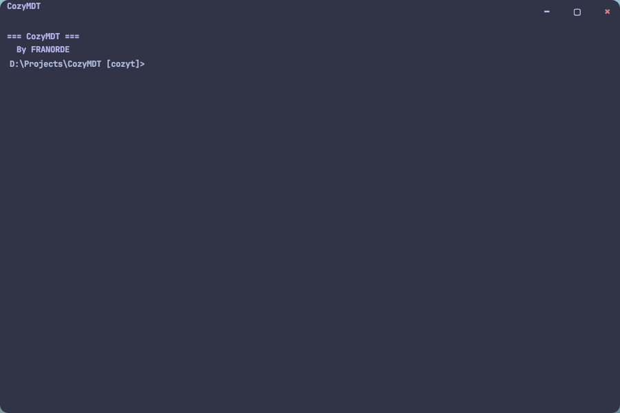

<p align="center">
  
</p>

<h1 align="center">CozyMDT</h1>
<p align="center">The Coziest terminal.</p>

<p align="center">
  
  
  
</p>

# Installation

## Step 1

Download the latest `CozyMDT-Setup-<version>.exe` from the [releases page](https://github.com/FRANORDE/CozyMDT/releases/latest) (use releases! Downloading the code directly might be unstable).

You don't need anything else: no zip to extract and no Rust to install.

## Step 2

Run the installer and follow the wizard. By default CozyMDT is installed in `%USERPROFILE%\bin` and no administrator rights are needed.

The wizard lets you choose:
- whether to add CozyMDT to your `PATH`, so it can be called from anywhere (Highly recommended)
- whether to create a desktop shortcut (a Start Menu entry is always created)

> **Note:** since the installer is not code-signed, Windows SmartScreen may show a warning the first time.
> Click **More info → Run anyway**.

## Uninstall

Use **Settings → Apps → Installed apps** and remove CozyMDT.

# Usage

Open CozyMDT from the Start Menu or your desktop shortcut.
If you added it to the `PATH`, you can also open it from the Windows Run dialog (⊞+R) by typing `CozyMDT`.

<p>
  
</p>

# Features

Features added in CozyMDT

## Custom commands

The custom commands added in CozyMDT all belong to the CozyT shell.
You can type `help` to open the commands menu.

### Most important new commands

- **switch** [OPTION] switches the current shell (e.g. `switch ps` switches to PowerShell, so you can use PowerShell commands).
- **settings** opens the settings file.

### Available shells

The available shells are:
- **PowerShell** (`ps` or `powershell` on the `switch` command)
- **CMD** (`cmd` on the `switch` command)
- **Git Bash** (`bash` on the `switch` command)
- **CozyT**, the CozyMDT custom shell (`cozyt` on the `switch` command)

# Known issues

## Laptops and small screens

On some laptops (especially older ones, or screens with a small resolution or high display scaling) the **custom title bar** may not display correctly: the window buttons can fall outside the window and text selection can be imprecise.

Laptop support is planned for a future release. In the meantime, using the **Windows title bar** is recommended, since it's the least affected. To switch:

1. Type `switch cozyt` and then `settings` to open the settings file.
2. Change the title bar option:
```jsonc
   "title_bar": "windows",
```
3. Save the file and restart CozyMDT.

# Optional tweaks

These are not required for basic usage.

## Customization

Customizing CozyMDT is easy: switch to the CozyT shell with `switch cozyt` and type `settings`.
If it asks you what app to open the JSONC file with, choose your favorite text editor (reccomended: Windows Notepad).
This opens a JSONC file where you can change the theme, font, title bar and rounded corners.
Restart CozyMDT after saving to apply the changes.

# Building from source

This is only needed if you want to compile CozyMDT yourself.

**Prerequisite:** [Rust](https://rustup.rs) must be installed.

```
git clone https://github.com/FRANORDE/CozyMDT.git
cd CozyMDT
cargo build --release
```

The executable will be in `target\release\CozyMDT.exe`.

# Notes, credits and licences

## Notes

- Some AI was used for development, but the code was manually reviewed and tested.
- Free and open-source software is the best software forever.

## Thanks to

- [Catppuccin](https://catppuccin.com/palette/) for their beautiful palettes
- [Nerd Fonts](https://www.nerdfonts.com/font-downloads) for the patched JetBrains Mono font (licensed under the OFL)
- [Inno Setup](https://jrsoftware.org/isinfo.php) for the great installer system
- You, for using CozyMDT!

## Licenses

CozyMDT is released under the [MIT License](LICENSE).

CozyMDT is built with [egui/eframe](https://github.com/emilk/egui) and other open-source Rust libraries. Their licenses (mostly MIT and Apache-2.0) are listed in [THIRD-PARTY-NOTICES.html](THIRD-PARTY-NOTICES.html), which is also installed with CozyMDT in the `licenses` folder.

- **JetBrains Mono (Nerd Font patched)** is bundled in the executable and licensed under the [SIL Open Font License 1.1](assets/OFL.txt).
- The **Catppuccin** color palettes aren't copyrighted (because they are colors), but are licensed under the MIT License.
- The installer is built with [Inno Setup](https://jrsoftware.org/isinfo.php).
